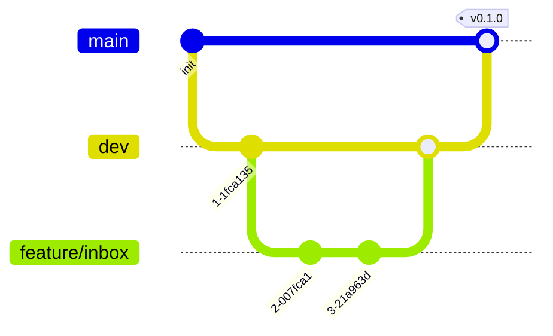

# GitHub

> [!success] Confirmé par l'utilisateur le 2026-05-15
> Source de vérité du code + CI/CD via [[Vercel]] integration.

## Rôle dans [[Freescale]]

- Hébergement du repo `freescale/freescale` (monorepo)
- Branch strategy : `main` (prod) / `dev` (staging) / `feature/*`
- Pull Request reviews avant merge
- Actions pour : tests, lint, type-check (les builds de prod = via [[Vercel]])
- Issues / Projects pour tracking (en complément de [[ROADMAP]])
- Dependabot pour les MAJ de sécurité auto

## Pourquoi GitHub

> [!tip] Forces
> - Standard de l'industrie → 99% des devs et outils s'y intègrent
> - **GitHub Actions** : 2000 min/mo gratuits sur les repos privés (large pour CI MVP)
> - **Dependabot** auto-PR sur les CVE de dépendances
> - **Secrets** stockage natif (pour les CI), même si on préfère Vercel/Doppler pour le runtime
> - **CodeQL** : scan de sécurité statique gratuit

## Branch strategy



| Branche | Protection | Deploy target |
|---|---|---|
| `main` | ✅ Require PR + 1 review + checks passing | `app.freescale.app` (prod) |
| `dev` | ✅ Require PR + checks passing | `staging.freescale.app` |
| `feature/*` | Aucune | Preview URLs (Vercel) |

## Workflow type

1. Créer une branche `feature/add-instagram-channel`
2. Push commits
3. Ouvrir une PR vers `dev`
4. CI tourne (lint + types + tests)
5. [[Vercel]] crée un preview deploy → URL partagée dans la PR
6. Review + merge
7. Quand `dev` est stable → PR `dev` → `main` → prod deploy

## CI Actions (étape 5)

> [!example] `.github/workflows/ci.yml`
> ```yaml
> name: CI
> on: [pull_request]
> jobs:
>   check:
>     runs-on: ubuntu-latest
>     steps:
>       - uses: actions/checkout@v4
>       - uses: pnpm/action-setup@v3
>       - uses: actions/setup-node@v4
>         with: { node-version: 20, cache: pnpm }
>       - run: pnpm install --frozen-lockfile
>       - run: pnpm lint
>       - run: pnpm typecheck
>       - run: pnpm test
> ```

## Repo settings recommandés

> [!info] Settings à activer dès la création
> - Branches protection sur `main` et `dev`
> - Require status checks before merging
> - Require linear history
> - Auto-delete head branches after merge
> - Dependabot security updates : ON
> - Secret scanning : ON
> - CodeQL : ON (gratuit sur repos privés <50 collaborateurs)

## Configuration future

| Item | Quand |
|---|---|
| Repo template | À la création |
| Branch protection | Avant le premier merge |
| GitHub Actions CI | Étape 5 |
| GitHub Projects (kanban) | Étape 89 (public roadmap) |
| Dependabot config | Step 6 setup |

## Liens utiles

- [GitHub Pricing](https://github.com/pricing) (Free Pro tier suffit largement au début)
- [Vercel + GitHub integration](https://vercel.com/docs/git/vercel-for-github)
